# 嵌入式GUI 挑战赛--智能控制网关
**中文** | [English](README_en.md)

## 作品简介

智能控制网关通过网络汇集控制节点的设备状态信息、环境数据、远程控制；    
节点设备数据处理，界面GUI显示各数据信息以及设备控制，同时数据同步到云端；  
网关具备安全报警功能，用户可界面配置报警策略，当报警触发后触发邮箱报警、界面提示；  
支持ftp上传日志功能，可于界面配置ftp服务器地址。  

## 硬件组成

网关： NXP RT1060EVKB、液晶显示屏、ESP-32  
节点： N32G457开发板、ESP-32  
PC：运行MQTT Broker、MQTTX、FTP Server、netassistant、网易邮箱查看邮件  

## 系统架构

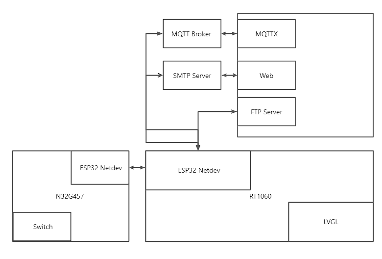

## 代码信息

AT_Device：驱动ESP32，生成wifi网卡  
at_socket：对接netdev进行socket编程  
cJSON：mqtt上班信息采用json格式  
**MAIL组件：连接SMTP服务器，发送报警邮件**  
dfs文件系统：用来存储日志  
**ulog：记录日志并保存到文件**  
**FTP组件：上传本地文件到FTP Server**  
湿度线程：定期读取DHT11湿度  
温度线程：定期读取DHT11温度  
NTP线程：定期同步远程服务器时间  
HTTP线程：定期获取远程服务器天气  
UDP线程：接收节点上报数据及控制命令的下发  
**ALARM线程：定期检测，触发报警**  
**MQTT线程：连接MQTT Broker，接收订阅MQTT主题的数据，回复设备状态信息以及报警推送**  
**LVGL线程：触摸屏交互，GUI界面展示：锁屏界面、主界面、设备状态界面、报警配置界面、远程同步界面以及报警弹窗**    
  

## 界面视图

**锁屏界面：时钟显示（周期更新），上划进入主界面。**  
  

**主界面：吉祥物显示，天气、时间显示（周期更新），显示菜单：设备状态、报警配置、远程同步。**  
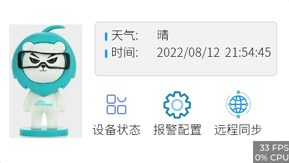   

**设备状态界面：设备列表展示，设备状态：温度、湿度、开关展示（周期更新），开关界面可进行本地操作控制阶段设备开关状态。**  
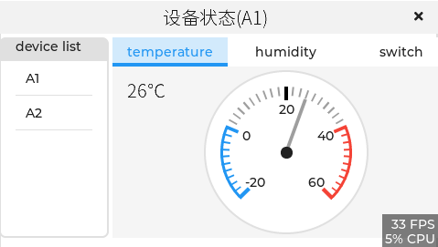  

**报警配置界面：设备列表展示，设备报警的开关控制，温度时设置，湿度设置**  
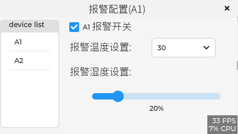  

**远程同步界面：**  
**mail：配置服务器地址端口号、用户名密码及接收邮箱地址，其中端口、用户名、密码、邮箱地址可以键盘输入修改。**  
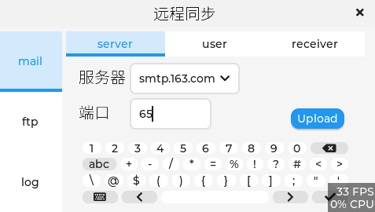  
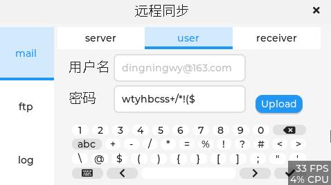    
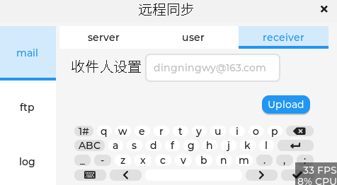  

**ftp：键盘输入配置服务器地址端口号，ftp上报日志按钮触发后上报日志文件到ftp服务器。**  
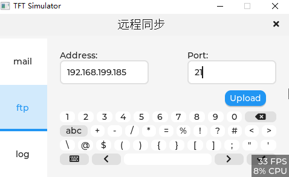  

**log：显示运行日志：**  
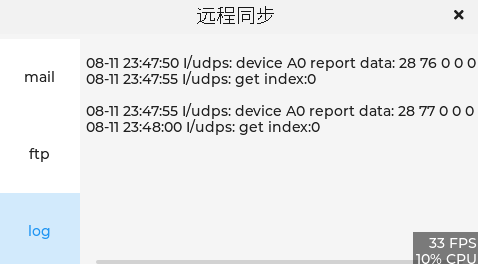  

**报警弹窗: 报警触发后，界面弹出弹窗，描述当前的报警信息。**  
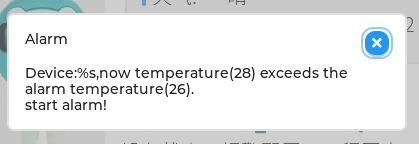  

## PC监听

**网关正常运行连接MQTT Broker(后续可以界面可配)，MQTT获取网关状态主题为：status/网关ID/get, 网关回复主题为：status/网关ID/put，交互json格式见下图：**   
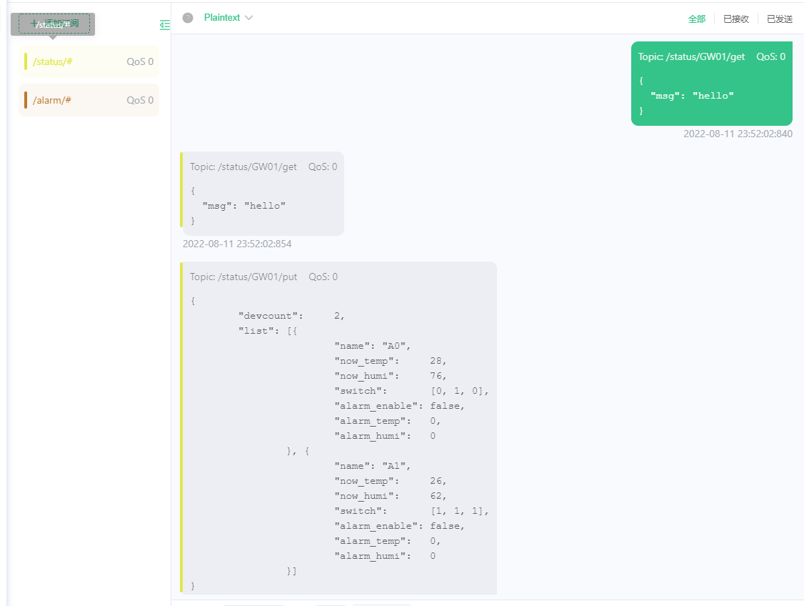  

**网关报警主题：/alarm/网关ID/设备ID，报警json格式如下：**  
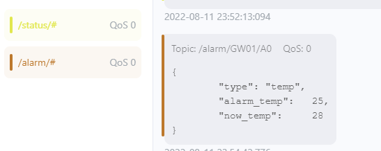  

**邮箱接送信息内容格式如下：**  
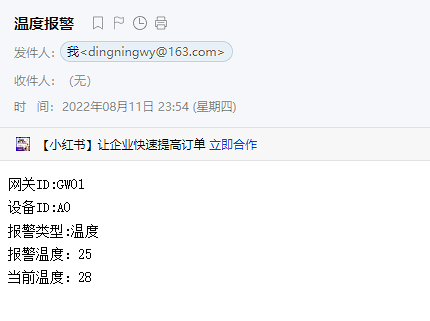  

## 视频演示地址
https://www.bilibili.com/video/BV1Pt4y1g7Uu/
