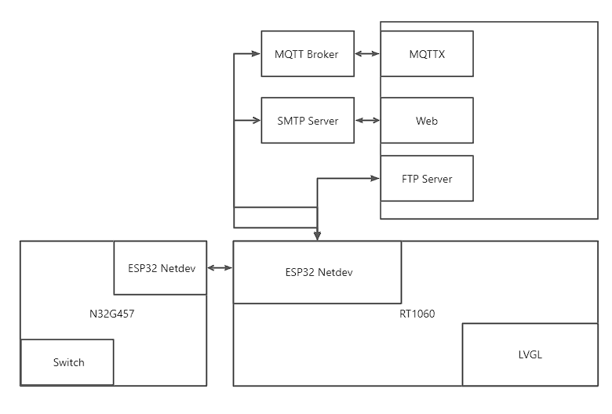
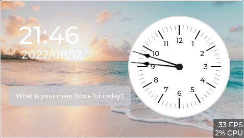
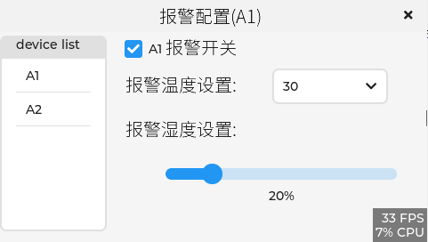
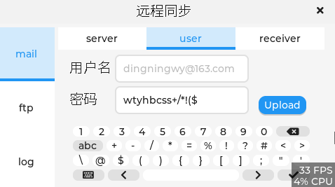
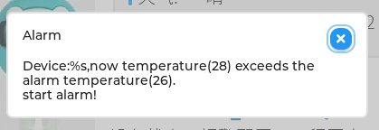
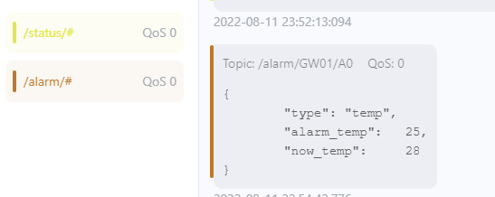

# Embedded GUI Contest--Intelligent control gateway
[中文](README.md) | **English**

## Introduction 
The intelligent control gateway collects the equipment status information, environment data and remote control of the control node through the network;  
Node equipment data processing, interface GUI displays various data information and equipment control, and data is synchronized to the cloud;  
The gateway has the security alarm function. The user can configure the alarm strategy on the interface. When the alarm is triggered, the mailbox alarm and the interface prompt will be triggered;  
Support FTP upload log function, and configure FTP server address on the interface.  

## Hardware 
Gateway: NXP rt1060evkb, LCD, esp-32  
Nodes: n32g457 development board, esp-32  
PC: run mqtt broker, mqttx, FTP server, netassistant and Netease mailbox to view mail  

## system architecture

## Code information
AT_Device: drive esp32 to generate WiFi network card  
at_Socket: socket programming with netdev  
cJson: mqtt work information is in JSON format  
**Mail component: connect to SMTP server and send alarm mail**  
DFS file system: used to store logs  
**Ulog: log and save to file**  
**FTP component: upload local files to FTP server**  
Humidity thread: regularly read DHT11 humidity  
Temperature thread: regularly read DHT11 temperature  
NTP thread: periodically synchronize the remote server time  
HTTP thread: get the weather of remote server regularly  
**UDP thread: receiving node reports data and sends control commands**  
**Alarm thread: regularly detect and trigger alarm**  
**Mqtt thread: connect to mqtt broker, receive data subscribed to mqtt topics, reply to equipment status information and push alarms**  
**Lvgl thread: touch screen interaction, GUI interface display: lock screen interface, main interface, equipment status interface, alarm configuration interface, remote synchronization interface and alarm pop-up window**  

## Interface View

**Lock screen interface:clock display (periodic update), click up to enter the main interface.**  
  

**Main interface: mascot display, weather and time display (periodic update), display menu: equipment status, alarm configuration, remote synchronization.**  
   

**Equipment status interface:display of equipment list; equipment status: display of temperature, humidity and switch (periodic update); the switch interface can be used to control the equipment switch status at the local operation control stage.**  
  

**Alarm configuration interface: display of equipment list, switch control of equipment alarm, temperature setting, humidity setting.**  
  

**Remote synchronization interface:**  
**Mail: configure the port number, user name and password of the server address and the receiving email address. The port, user name, password and email address can be entered and modified by keyboard.**  
  
    
  

**FTP:enter the address and port number of the configuration server on the keyboard. After the FTP report log button is triggered, the log file will be reported to the FTP server.**  
  

**log：show run log：**  
  

**Alarm pop-up window: after the alarm is triggered, a pop-up window will pop up to describe the current alarm information.**  
  

## PC monitoring
**The gateway operates normally and connects to mqtt broker (the interface can be configured later). The topic for mqtt to obtain gateway status is: status/gateway ID/get, and the topic for gateway reply is: status/gateway ID/put. The interactive JSON format is shown in the following figure:**  
  

**Gateway alarm subject: /alarm/gateway ID/device ID, alarm JSON format is as follows:**  

**The content format of the mailbox transfer information is as follows:**  

## Video Presentation Address
https://www.bilibili.com/video/BV1Pt4y1g7Uu/
